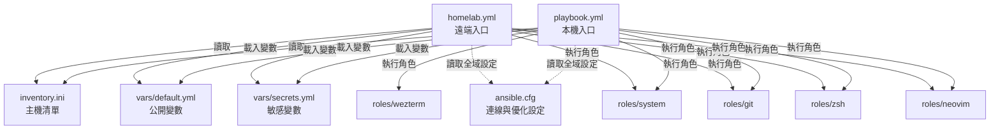

# eton-ansible 專案架構與學習導讀指南

這份指南將幫助您系統化地閱讀與理解此 Ansible 專案。透過這套設定，您可以同時管理本機（Localhost）與遠端伺服器（Homelab）的開發環境。

---

## 視覺化架構圖

以下是此專案中各個檔案與角色（Roles）之間的關聯性：

---

## 🗺️ 學習與閱讀路徑（建議順序）

當您要開始研究這個專案時，建議按照以下順序「由外而內」進行閱讀：

### 第一步：入口與核心設定（專案骨架）
這部分的檔案定義了「誰在哪裡執行什麼」。
* **[playbook.yml](file:///home/sixson/eton-ansible/playbook.yml) & [homelab.yml](file:///home/sixson/eton-ansible/homelab.yml)**
  * **看點**：了解 `vars_files` 是如何引入變數的，以及 `roles` 執行的先後順序。您會發現本機多了 `- role: wezterm`。
* **[inventory.ini](file:///home/sixson/eton-ansible/inventory.ini)**
  * **看點**：了解 Ansible 如何區分群組（`[localhost]` 與 `[homelabs]`），以及如何為特定主機指定 SSH 參數（例如 `ansible_become_exe`）。
* **[ansible.cfg](file:///home/sixson/eton-ansible/ansible.cfg)**
  * **看點**：了解連線優化（`pipelining = True`）與全域逾時（`timeout`）設定。

### 第二步：變數管理（參數中心）
所有的路徑、套件開關、個人資訊都集中在這裡。
* **[vars/default.yml](file:///home/sixson/eton-ansible/vars/default.yml)**
  * **看點**：定義非敏感的通用設定，如 dotfiles 倉庫網址、Neovim 設定檔路徑，以及是否安裝 `bun` 或 `podman`。
* **[vars/secrets.yml](file:///home/sixson/eton-ansible/vars/secrets.yml) & [secrets.yml.example](file:///home/sixson/eton-ansible/vars/secrets.yml.example)**
  * **看點**：查看如何與 `.gitignore` 搭配，來安全地儲存 Git 帳號、密碼或伺服器 IP。

### 第三步：角色行為（核心邏輯）
Ansible 的精華在於 `roles` 目錄下的任務設定。每一個 Role 都包含一個 `tasks/main.yml`，這是該角色執行的指令清單。

請依序閱讀這 5 個角色：

1. **[roles/system/tasks/main.yml](file:///home/sixson/eton-ansible/roles/system/tasks/main.yml)**
   * **功能**：更新 apt 緩存、安裝通用套件（zsh、git、curl等）、安裝 Podman 與 Bun，並設定 SSH Config。
   * **重點**：學習 `apt`、`shell` 與 `template` 模組的使用方法。
2. **[roles/git/tasks/main.yml](file:///home/sixson/eton-ansible/roles/git/tasks/main.yml)**
   * **功能**：部署您的全域 `.gitconfig` 和工作專用的 `.gitconfig-ginmao`。
   * **重點**：學習如何使用 Jinja2 模板（`.j2` 檔案）帶入變數。
3. **[roles/zsh/tasks/main.yml](file:///home/sixson/eton-ansible/roles/zsh/tasks/main.yml)**
   * **功能**：下載 dotfiles、建立 Zsh 設定軟連結、安裝 Oh My Zsh、安裝主題與插件（p10k, syntax-highlighting, autosuggestions）。
   * **重點**：學習 `git` 模組、`file` 模組（建立 symlink）、以及使用 `loop` 批次建立目錄。
4. **[roles/neovim/tasks/main.yml](file:///home/sixson/eton-ansible/roles/neovim/tasks/main.yml)**
   * **功能**：從 GitHub 下載最新的 Neovim 解壓縮安裝、建立 `/usr/local/bin` 的連結、下載您的 Neovim 設定檔，並觸發 Lazy.nvim 與 Mason 的 headless 安裝。
   * **重點**：學習 `block`（將多個任務打包並加上 conditional）、`get_url`、`unarchive` 以及 headless 執行 CLI 工具。
5. **[roles/wezterm/tasks/main.yml](file:///home/sixson/eton-ansible/roles/wezterm/tasks/main.yml)**
   * **功能**：建立 wezterm 設定檔連結，並下載安裝 JetBrainsMono Nerd Font。
   * **重點**：字型下載、解壓縮與更新本機字型快取（`fc-cache`）。

---

## 💡 關鍵 Ansible 語法學習要點

在看這些任務時，可以特別留意以下常見且強大的語法：
* **`become: true`**：切換為 `root` 執行（等同於執行 `sudo`）。
* **`when: ...`**：條件判斷（例如 `when: ansible_os_family == "Debian"` 只在 Debian/Ubuntu 執行）。
* **`register: ...`**：將前一個步驟的執行結果存入變數，供後面的步驟判斷（例如 `stat` 模組或 `which` 指令 the 結果）。
* **`changed_when: ...`**：自訂什麼時候算是有「改變狀態」，常用於自訂 shell 指令，避免每次執行都顯示 `changed`。
* **`creates: ...`**：常用於 `shell` 模組，如果某個檔案已經存在就不重複執行該指令（例如下載/安裝檔）。
